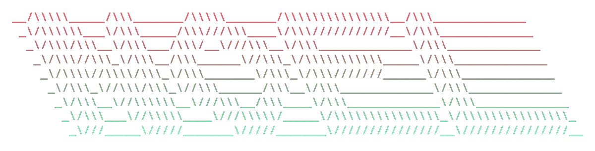

<h2 align="center">Hey, I'm</h2>

  

<h3 align="center">I'm a mastery student at School42 (currently doing an internship), previously concept / 3D artist and hobby electronic music production ethusiast.</h3>

### 🔧 &nbsp;My Toolbox

  <a href="https://skillicons.dev">
    
Tools/Frameworks:

    
    
Software:

    
    
Languages:

    
  </a>

### 📚 &nbsp;Notable Academic Projects

Some stuff I've done as a student I am proud of.
- [ft_transcendence (42)](https://github.com/kixikCodes/ft_transcendence)
- [miniRT (42)](https://github.com/kixikCodes/miniRT)
- [Webserv (42)](https://github.com/kixikCodes/webserv)

### 🧪 &nbsp;Notable Personal Projects

Some of my own project ideas.
- Project Abiogenesis (in early concept stage)
- [Grimoire](https://github.com/KixiKcodes/Grimoire)
- And its predecessor [BotC Gamemaster](https://github.com/kixikCodes/BOTC_Gamemaster)
- [traSH](https://github.com/KixiKcodes/traSH)

### 📊 &nbsp;Profile Stats

